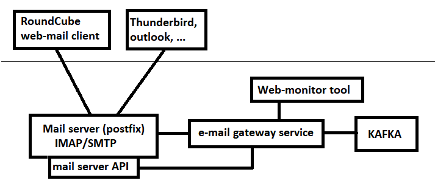

# E-mail gateway
Exchange e-mail messages between e-mail server and KAFKA bus (ISimulationEntityPost)

* Running in a complete standalone docker environment (no connection with other mail servers)
* Runs out-of-the-box ((almost) no configuration)
* Uses fully compatible SMTP/IMAP server (postfix server)
* All domain names allowed for e-mail addresses
* E-mail address are created on the fly, no need to configure
* Attachments are supported (stored in Large File service)
* Build-in web-based mail application (RoundCube)
* Possible to use external mail applications like outlook, thunderbird
* Web based management portal to monitor mail server
* The timestamp of the mail message can be modified 

## Getting started

The entire service can run in docker containers.

To build the docker images locally (will be placed in dockerhub in the future):

`Run 'email-gateway\docker\mailserver\BuildAllDockerImages.bat'`

To run the service (will also start KAFKA, Large File Service etc.)

`* Run 'StartDockerContainers.bat'`

`* Open webbrowser on port 4200`

## Overview

## Documentation

- [Server documentation](packages/server/ReadMe.md)
- [Mapping between KAFKA and MAIL server](documentation/Mapping.md)
- [Configuration](documentation/Configuration.md)

## Known limitations

* In the current situation all passwords for the mail accounts are the same. It is possible to provide each user his own password, but the service needs to known the password to check the outbox (sending messages to kafka)
* When enabled, the monitor-website is accessible for everyone.

.