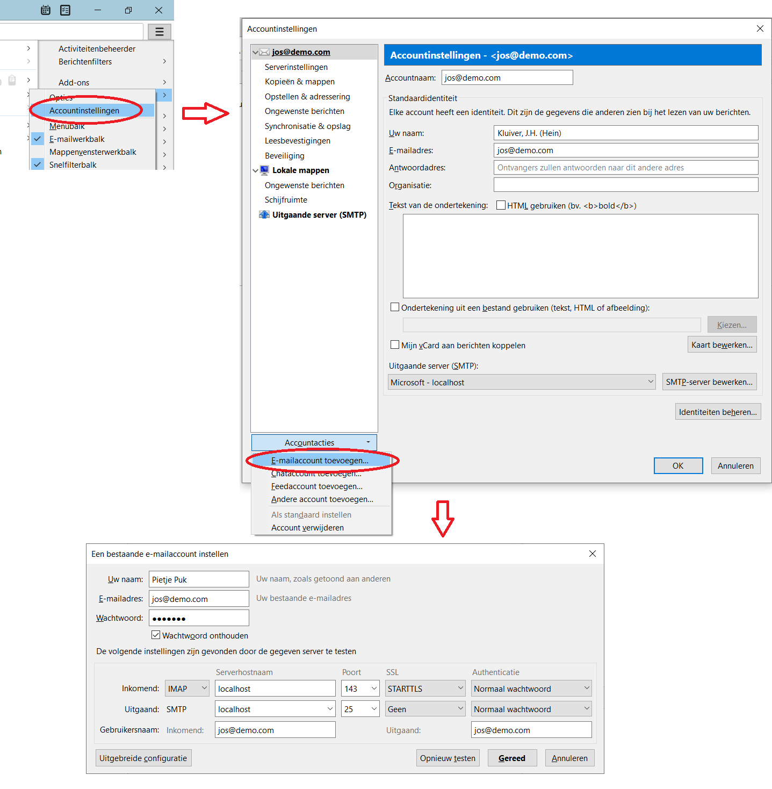

# External mail-clients

It is possible to use external mail clients. In the example below thunderbird is configured. In the example 'localhost' is used, must point to the docker machine. The server doesn't has certificates configured, so the client could show warnings for TLS.

