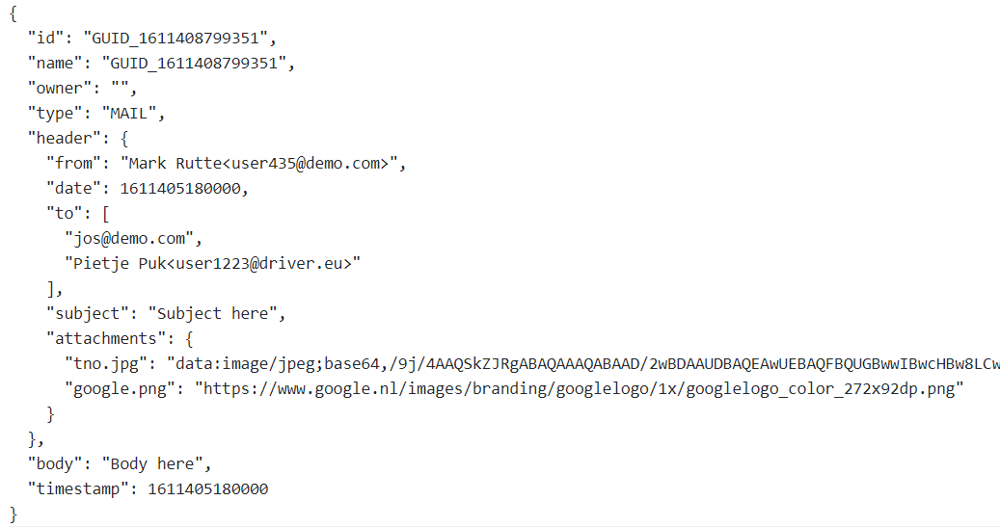

### Mapping between e-mail and  SimulationEntityPost

The AVRO scheme can be found at 'https://github.com/DRIVER-EU/avro-schemas' in file '\sim\entity\simulation_entity_post-value.avsc'.

| AVRO                 | E-MAIL                         | COMMENT                                                      |
| -------------------- | ------------------------------ | ------------------------------------------------------------ |
| id                   |                                | Used in logging to identify post.                            |
| body                 | Body                           | Can be HTML or plain text                                    |
| header.from          | From                           | Always one e-mail addresses (see section E-mail address)     |
| header.date          | Time sent                      | This is the time shown in e-mail. The AVRO schema uses epoch time in seconds (see section epoch time); |
| header.to[]          | To                             | Zero or more e-mail addresses (see section E-mail address)   |
| header.cc[]          | Cc                             | Zero or more e-mail addresses (see section E-mail address)   |
| header.bcc[]         | Bcc                            | Zero or more e-mail addresses (see section E-mail address)   |
| header.subject       | Subject                        | The subject of the e-mail                                    |
| header.intro         | Ignored                        |                                                              |
| header.location      | Ignored                        |                                                              |
| header.attachments[] | Attachments                    | Url link to the large file storage service, or raw content as base64 encoded |
| header.location      | Ignored                        |                                                              |
| name                 |                                | Same as ID                                                   |
| type                 |                                | Must always have value 'MAIL'                                |
| owner                |                                | Filled by gateway service when sending message from KAFKA (to prevent ping pong effect) |
| timestamp            | Ignored                        |                                                              |
| tags                 | Ignored                        |                                                              |
|                      | Header: x-gateway-key          | Set to value 'KAFKA' when KAFKA message is converted to e-mail. |
|                      | Header: X-Place-In-Sent-Folder | Set to value 'YES' by e-mail gateway service; used by sieve to place message in sent folder (from address). |



## Epoch time

The Unix epoch (or Unix time or POSIX time or Unix timestamp) is the number of seconds that have elapsed since January 1, 1970 (midnight UTC/GMT), not counting leap seconds (in ISO 8601: 1970-01-01T00:00:00Z).
Important: seconds is used, not msec !! 

## Attachments

In the Simulation Entity Post 'attachments' section the attachments are stored. It is dictionary where key is the (file)name and value the content (in the AVRO schema the key and value are swapped, but this is more logical'. 

There are two methods for the content:

* web url - The content is stored behind a http or https url. This can be a public webserver or the Large File Service (recommended).

* base64 - The content is stored as base64 in the message (not recommended). The "data" URL scheme is described here [RFC2397](https://tools.ietf.org/html/rfc2397)

  ```
  dataurl    := "data:" [ mediatype ] [ ";base64" ] "," data
  mediatype  := [ type "/" subtype ] *( ";" parameter )
  data       := *urlchar
  parameter  := attribute "=" value
  ```

The attachments can travel in two directions:

* KAFKA => MAIL Server: The gateway will download the content Simulation Entity Post (url and base64). And add it as attachment to the e-mail.

* MAIL Server => KAFKA: The attachments in the e-mail are downloaded and placed in the Large File Service. The url of the LFS is passed into the attachment section of Simulation Entity Post.

  When the attachment section of Simulation Entity Post is not an valid url, the content is handled as binary data (this make it possible e.g. to send small text messages). 

## E-mail address

The gateway uses rfc2822 for e-mail validation.

Example of valid e-mail addresses:

* Name <<address@domain>.nl> (with display name)
* address@domain.nl (without display name)
* Name <<address@domain>>;address1@domain 

Display name -  When the format  'display name<<address@domain>>' is used, the e-mail web client  will display the name instead of the e-mail address. For example 'Pietje Puk<<user232@driver.eu>>', the e-mail client will show 'Pietje Puk'.

For validation and parsing of the e-mail address 'https://github.com/nodemailer/nodemailer/blob/master/lib/addressparser/index.js' is used.


## Clear mail database

A Simulation Entity Post with id 'RESET_SCENARIO_REMOVE_ALL' will clear the entire mailserver (mailboxes and e-mail accounts).