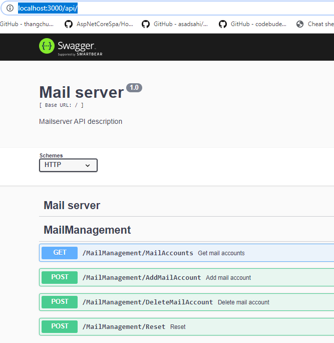

# Swagger (OpenApi)

The [NEST.JS framework](https://nestjs.com)  is used to setup an REST server. The NESTJS framework uses under the hood [swagger](https://swagger.io/).  In swagger the REST interface is defined in JSON or YAML file. With code generators a client or server code can be generated. The NEST.JS uses the code first approach, the REST API calls are written in code (with annotation),  based on this (meta) information a swagger definition file can be generated runtime.

A REST interface is used for:

* Mail server: manage user accounts, used by mail server gateway
* Mail server gateway: monitor gateway, used by web based mail monitor 

## Test swagger interface

When the mail server and mail server gateway are running the REST API can be inspected:

* Mail server:  http://localhost:3000/api/ 

* Mail server gateway:  http://localhost:3000/api/

* 

  

## Generate swagger code

When the REST API interface changes the REST clients must be (re)generated. This is done with the swagger interface definition. The mail server and mail server gateway must be running because the swagger definition file is generated at runtime by the server.

## Code generator (docker)

The official [code generator](https://swagger.io/tools/swagger-codegen/) from swagger is used . To minimize configuration the code is generated in a docker container with shared volume.